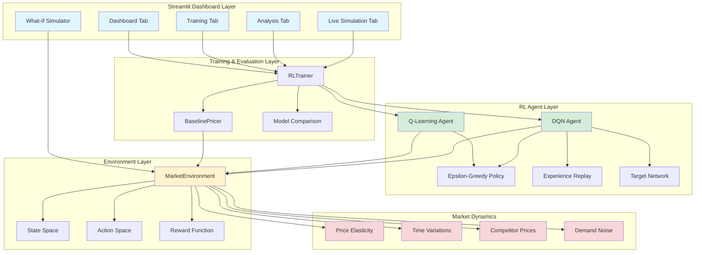
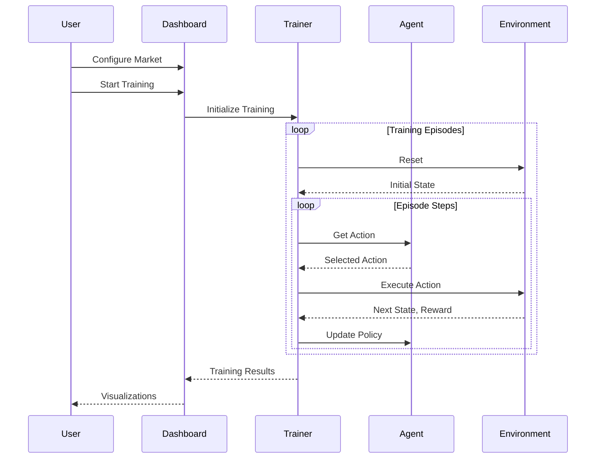
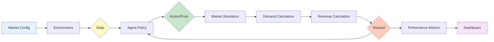

# System Architecture Diagram

```mermaid
graph TB
    subgraph "Streamlit Dashboard Layer"
        A[Dashboard Tab] 
        B[Training Tab]
        C[Analysis Tab]
        D[Live Simulation Tab]
        E[What-If Simulator]
    end
    
    subgraph "Training & Evaluation Layer"
        F[RLTrainer]
        G[BaselinePricer]
        H[Model Comparison]
    end
    
    subgraph "RL Agent Layer"
        I[Q-Learning Agent]
        J[DQN Agent]
        K[Epsilon-Greedy Policy]
        L[Experience Replay]
        M[Target Network]
    end
    
    subgraph "Environment Layer"
        N[MarketEnvironment]
        O[State Space]
        P[Action Space]
        Q[Reward Function]
    end
    
    subgraph "Market Dynamics"
        R[Price Elasticity]
        S[Time Variations]
        T[Competitor Prices]
        U[Demand Noise]
    end
    
    A --> F
    B --> F
    C --> F
    D --> F
    E --> N
    
    F --> I
    F --> J
    F --> G
    F --> H
    
    I --> K
    J --> K
    J --> L
    J --> M
    
    I --> N
    J --> N
    G --> N
    
    N --> O
    N --> P
    N --> Q
    
    N --> R
    N --> S
    N --> T
    N --> U
    
    style A fill:#e1f5ff
    style B fill:#e1f5ff
    style C fill:#e1f5ff
    style D fill:#e1f5ff
    style E fill:#e1f5ff
    
    style I fill:#d4edda
    style J fill:#d4edda
    
    style N fill:#fff3cd
    
    style R fill:#f8d7da
    style S fill:#f8d7da
    style T fill:#f8d7da
    style U fill:#f8d7da
```

## Component Flow

```mermaid
sequenceDiagram
    participant User
    participant Dashboard
    participant Trainer
    participant Agent
    participant Environment
    
    User->>Dashboard: Configure Market
    User->>Dashboard: Start Training
    Dashboard->>Trainer: Initialize Training
    
    loop Training Episodes
        Trainer->>Environment: Reset
        Environment-->>Trainer: Initial State
        
        loop Episode Steps
            Trainer->>Agent: Get Action
            Agent-->>Trainer: Selected Action
            Trainer->>Environment: Execute Action
            Environment-->>Trainer: Next State, Reward
            Trainer->>Agent: Update Policy
        end
    end
    
    Trainer-->>Dashboard: Training Results
    Dashboard-->>User: Visualizations
```

## Data Flow

```mermaid
flowchart LR
    A[Market Config] --> B[Environment]
    B --> C{State}
    C --> D[Agent Policy]
    D --> E{Action/Price}
    E --> F[Market Simulation]
    F --> G[Demand Calculation]
    G --> H[Revenue Calculation]
    H --> I{Reward}
    I --> D
    I --> J[Performance Metrics]
    J --> K[Dashboard]
    
    style A fill:#e3f2fd
    style C fill:#fff9c4
    style E fill:#c8e6c9
    style I fill:#ffccbc
    style K fill:#f3e5f5
```
